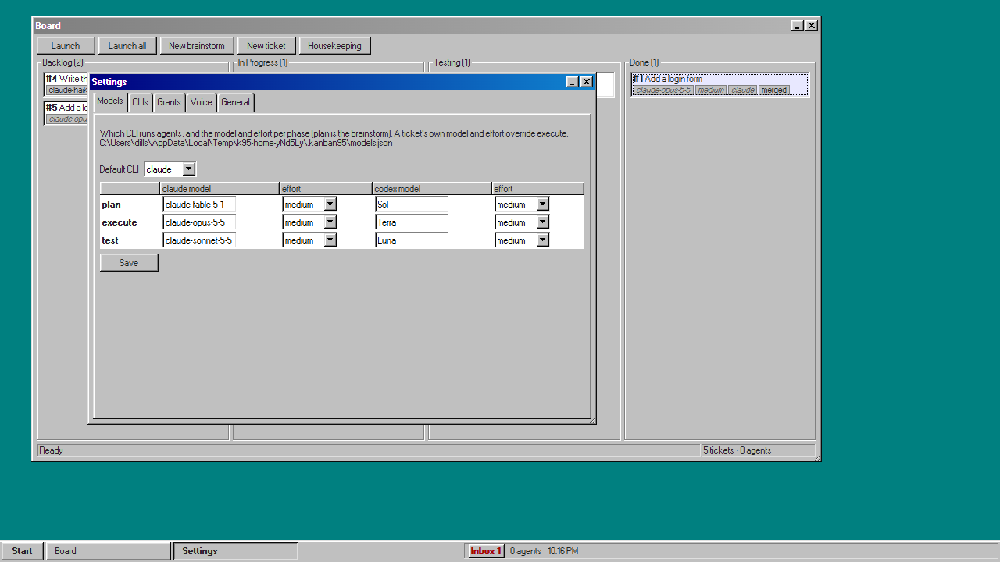
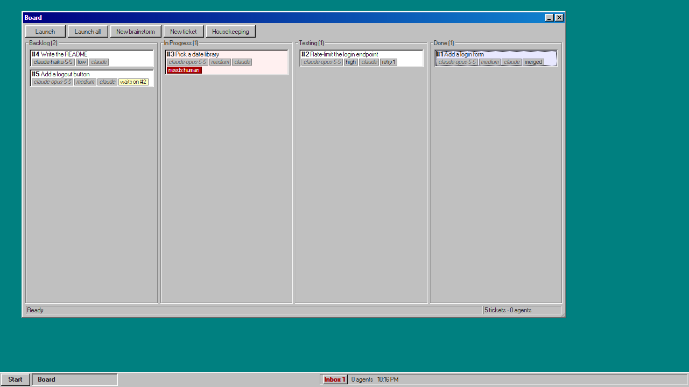
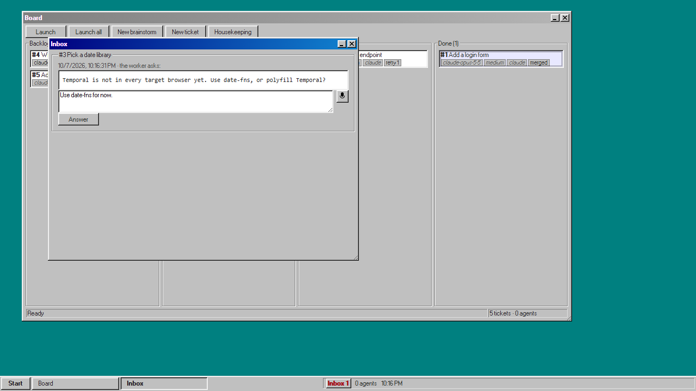
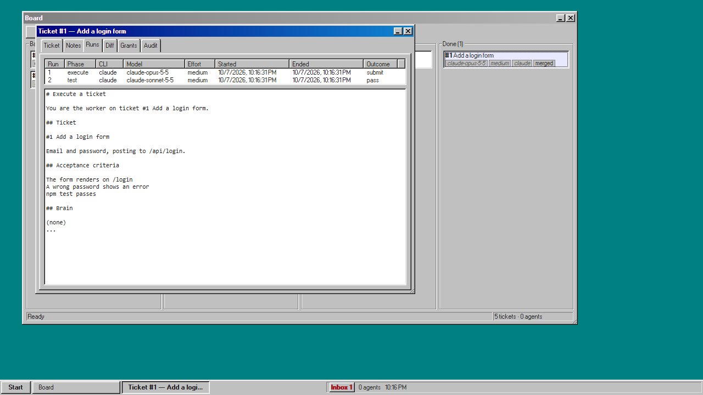
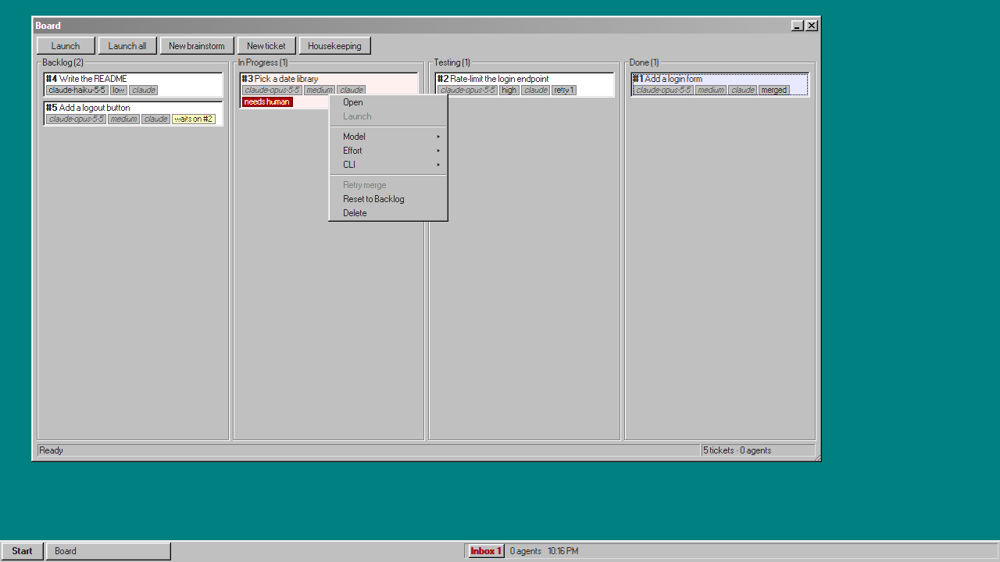
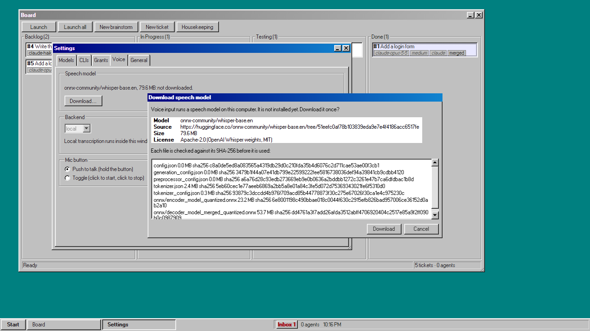

# Operating the board

Living document. How a person drives Kanban95, from an idea to merged work. Update it in the same change that moves a button.

## Before the first launch

1. Log in to Claude Code and/or Codex CLI with their own commands. The board never asks for a key.
2. For Claude Code, accept its one-time `--dangerously-skip-permissions` warning by hand once (`docs/CLIS.md`).
3. Start the board: on Windows double-click `Kanban95.vbs` (no console window; a dialog says why if it cannot start) or `Kanban95.cmd` (keeps a console), on macOS `Kanban95.command`; drop the project folder you want it to work on onto it, or pass it as the argument (`README.md` → Quickstart). Open **Start → Settings → Models**, pick the default CLI and a model and effort for each phase (type a model id, or press ▾ beside the box for every model that CLI knows) (plan is the brainstorm, execute does the work, test checks it), and press **Save**. That writes `~/.kanban95/models.json`; until it exists nothing can launch, and the Board's status bar says so.

## A full cycle

### 1. Brainstorm

**New brainstorm** (or Ctrl+N) opens a terminal with a planner agent in the repo root. Tell it what you want. It reads the code and the brain, proposes tickets, and writes them to the board with `create_ticket` once you agree. The planner cannot write files. Cards appear in Backlog as it creates them.

### Operator terminal

For board work that is not a ticket: maintenance on the repo, a refactor you want to steer live, a one-off investigation, fixing the board itself. **Start → New operator terminal** (or Ctrl+Shift+N) asks for a **Mission** (the mic works there too) and opens a terminal titled `Operator — <model>` in the repo root with an agent whose brief starts from your mission, word for word. An empty mission is refused.

The agent has your reach on the board and nothing beyond the repo and the board: it can read and list every ticket, create and edit tickets, add notes, change a ticket's model, and move tickets through the usual steps (launch, submit, fail; it cannot pass a ticket, only a tester can). It has full tools in the repo, works in its own worktree under `.worktrees/op-<time>` when it changes code, merges that itself when the tests pass, and ends with a short summary in its terminal. It does not create tickets unless your mission asks it to.

It runs with the **operator** row of Settings → Models (blank: the CLI's own default model, launched with no `--model`), unless `.kanban95/config.json` has `"operator": { "model": "...", "effort": "..." }` (either or both). It shows in the agent count and the taskbar like a brainstorm. Closing its window does not stop it; **Revoke** its grant in Settings → Grants, or close the board, does.

### 2. Run

**Run** (or Ctrl+L, or Start → Run) works the backlog for you, up to three tickets at a time, smallest first: it launches tickets, and as each one executes, passes its test and merges, launches the next, until nothing launchable is left. Change how many run at once in Settings → General → Runner, "Tickets running at once" (1 to 10), and Save; it applies at once. The button then reads **Stop**, and the status bar shows `Running: #a, #b (2 of 3; n of m candidates left)`: the tickets it is on against the limit, how many backlog tickets it can launch now, out of everything in Backlog. It keeps tickets that name the same code files apart: one that shares a file with a running ticket waits, and the status bar adds `#id waits: shares files with #n`; when every ticket left shares a file, it starts the first anyway. Smallest means lowest effort first (low, medium, high, max; no effort counts as medium), then fewest acceptance-criteria lines, then lowest id.

It skips what needs you: a red (needs human) ticket waits in the Inbox, and so does anything depending on it, while the runner moves on. When nothing is running and nothing is left it turns itself off with a ding and the status bar says "Runner stopped: nothing left to launch". **Stop** (or Ctrl+L again) starts nothing new; agents already running finish their step and merge. Stop also clears every wait on a dependency (below), so nothing you staged starts later by itself; the status bar says "Runner stopped, n holds cleared." While it is off the board starts no agent by itself at all: a ticket waiting on a dependency stays in Backlog when that dependency merges, the scheduled housekeeping ticket is filed but not launched, and a merge conflict sent back to its worker waits In Progress with no agent. All of them start when you press **Run**. It stays on across a restart.

To start tickets yourself, select them and press **Launch**, runner on or off. A ticket whose dependencies have not merged waits with a yellow "waits on #n" badge and starts by itself when they land, if the runner is on. While any ticket waits like this the status bar says `n waiting to launch by themselves`. **Stop** clears every wait at once; **Cancel wait** in a card's menu clears one. Either way the ticket stays in Backlog with its retry count and notes, and starts only when you launch it or the runner picks it up.

Each card shows its id, title, model, effort and CLI (grey italic means "the phase default from Settings"), then its tags (light blue; set them in the ticket window's **Tags** field, comma or space separated, lowercase letters, digits and `-`), and badges for what needs attention: **running** (an agent is working on it), **needs human** (red), **retry n**, **merged**, **housekeeping** (a ticket the board filed to clean up).

### 3. Watch, or don't

Every agent gets its own terminal window titled `#id — phase — model`. The board opens them by itself, behind whatever you are working in, tiled into the slots left of the Board, Inbox and Notepad (see Terminal slots below; each keeps its slot until you move it), for the phases ticked in **Settings → General → Open a terminal automatically for** (plan, execute, test; all three by default). Brainstorms and operator terminals always open. A session without a window still runs and reports as usual; to watch one, right-click its card → **Terminal** → `phase · model` (one entry per live session of the ticket), or Ticket → Runs → **Terminal**. A session that did not open never pops up later, also after you tick its phase. The setting is `terminals.auto` in `~/.kanban95/settings.json` and applies to the next session that starts; a terminal whose agent finished its step, or that the board ended to start a new one (a merge conflict on submit, a Restart), closes itself a moment later (its output stays in the ticket's Runs tab). If a card says *running* but the terminal in front says "(ended)", the ended one is an older run: the live one is behind it, in the taskbar, or under Ticket → Runs. You can type into any terminal; it is the agent's real session. **Minimize** hides a terminal and keeps its agent running (reopen it from the taskbar or Ticket → Runs). **X** stops the agent for good: it asks first ("End the agent for #id? The ticket is flagged so you can resume it. Minimize to keep it running."; for a brainstorm, "End this brainstorm?"; for an operator terminal, "End this operator terminal?"), and Cancel or Esc keeps everything running. A terminal whose ticket starts needing you comes to the front, also out of minimized, without taking the keyboard from what you are typing in. An ended ticket agent turns the card red with the note "ended by the operator from the terminal window" and offers **Resume** in the Inbox and the card menu. A terminal titled "(ended)" has no agent left, so its X just closes the window.

The ticket moves on its own: In Progress → Testing → Done. A failed test sends it back to In Progress with the tester's notes, up to three retries. When it merges you hear the **ding**.

### 4. When the board needs you

The board fixes what it can before it asks you. When a worker submits, the board first merges the base branch into the ticket's worktree (a merge commit "Merge main into ticket/12" on the ticket's branch, authored as you), so the tester tests the combined code; it does the same again in the merge queue just before landing, so the merge into your main checkout never conflicts and never leaves it mid-merge. If that merge conflicts, or the worktree has uncommitted changes, the ticket goes back to the worker: it stays or returns to In Progress (retry + 1) with a failure note "merge conflict with main: …" (or "worktree has uncommitted changes"), and the agent merges the base in its worktree, resolves the conflict, and submits again. A merge refused only because the main checkout has uncommitted changes is not flagged: the board retries it every 30 seconds and it lands once you commit or stash. So never leave edits in the main checkout while the board runs; work in a worktree.

You hear the **chord** and a card turns red when an agent asks a question, exits without reporting, goes silent (its transcript gains no line for 20 minutes), hits the retry cap, its merge still conflicts at the retry cap, the main checkout is still dirty after 10 minutes, or its merge landed but could not be pushed. Every one of these lands in the **Inbox** (the "Inbox n" button in the taskbar tray at the far right, by the clock; n counts them all), and the ticket's facts line says "needs human (the Inbox says why)". A question has an answer box: type the answer and press **Answer**; it is typed into the agent's terminal and the card's badge clears. Anything else shows the note that flagged it: what happened, then a line starting **To resolve:** with your next step (for a merge conflict it names the worktree, e.g. `.worktrees/t-12`, and the button: **Resume** if the ticket is In Progress, **Retry merge** if it is Done; otherwise the button). **Retry merge** re-runs the whole queue job, including the merge of the base into the worktree, so a fix you committed there is checked against the latest base. Its buttons are **Open ticket**, **Retry merge** (a done ticket that has not merged), **Resume** and **Restart** (a running ticket) and **Reset to Backlog** (any ticket not done). The Board's status bar also says why at the moment a card turns red (`#n needs you: …`). A launch the board refuses outright (no models saved, uncommitted changes on the base branch) starts no agent and opens no terminal (the card moves to In Progress and turns red with `launch failed: …`), so that line and the Inbox are where its reason shows. For an agent that went away (it crashed, its launch failed, it exited without reporting), press **Resume**: the agent for the ticket's phase starts again in the same worktree with the retry count kept. A Claude Code agent picks up its own conversation where it stopped (when Claude Code still has it); a Codex agent, or one whose conversation is gone, starts fresh with the failure note in its brief. Resume is also in the card menu, and **Launch** on such a card does the same. Launch on a card whose agent is still running is refused: open its terminal, or Reset to Backlog to stop it. For an agent that is still running but stuck (idle, hung, waiting on nothing), press **Restart** (card menu, ticket window, Inbox, or Ctrl+R in a ticket window) and confirm: the running agent is ended and a new one starts in the same phase and worktree, retry count kept, told to read `git status` and `git log` and carry on. Reset to Backlog, by contrast, starts the ticket over.

An agent can also stop without exiting: an API call that never returns, or a CLI sitting at its prompt after an error (a model it does not know). Its spinner may still turn, so the board goes by its transcript: when a running agent's Claude Code transcript (or Codex rollout) has gained no line for **Settings → General → Silent agents** minutes (`idle_minutes` in `~/.kanban95/settings.json`, default 20), the card turns red with the chord and the note "agent silent for N min", followed by the last lines of its terminal. The agent keeps running: open its terminal (card menu → **Terminal**), fix what it is waiting on there, or press **Restart** if it is hung. If it starts writing again on its own, the flag clears by itself. Keep the setting above 10 minutes, the longest a single command an agent runs may take, so a long test run is not flagged.

When the board restarts, every agent it was running is killed. Tickets that were running and not flagged are resumed by themselves, once, a Claude Code agent in its own conversation; you only hear the chord if a resumed agent then exits without reporting. A ticket that was already red before the restart stays red until you resume it.

**Start → Restart board** picks up daemon and UI changes (after a merge into `daemon/` or `ui/`, say) without closing the window. The confirm says how many agents are running (they are resumed after the restart, as above) and how many brainstorm or operator terminals will close. On **Restart** the board runs `npm run build` in the Kanban95 checkout, the status bar says "Restarting…", the daemon starts again on a new port and the window reloads there. If the build fails, nothing restarts: a dialog shows the compiler output and the board keeps running. An installed board has nothing to build and just restarts. It does not pick up changes to `shell/` (those need `cargo build` and closing and starting Kanban95 again), nor a new `npm install`.

**"Restart the board to use the merged changes."** A merge only changes files on disk: the UI is served from disk and updates at once, but the daemon keeps running the code it started with. So after a merge that changed `daemon/`, `shell/`, `package.json` or `package-lock.json`, the Board's status bar shows this line and the taskbar tray shows a red **Restart** badge next to the Inbox count; until you restart, new buttons may call routes the running daemon does not have. Click the badge (or Start → Restart board). When the merge changed `shell/`, the confirm adds that the shell needs a full relaunch: after the restart, close Kanban95 and start it again. Both go away once the daemon starts on the merged code. Merges that touch only `ui/` or `docs/` show nothing.

For anything else, open the ticket (double-click the card): the Notes tab has the failure notes, Runs has each run's exact prompt and terminal output, Diff shows what the worktree changed.

### 5. Done

A ticket counts as merged only once its work is published: after the merge into your base branch, the board runs `git push` of that branch to its upstream (say `origin/main`) from the main checkout, which also sends any earlier commits you had not pushed. Git signs in with your own credential helper or SSH key, as when you push by hand; the board never sees them. If the push fails (the remote has commits you lack, you are offline or signed out), the merge stays in your branch, the ticket stays in Done with a red card and the chord, and its note quotes git's message. Fix it in the main checkout (pull and merge, reconnect or sign in), then **Retry merge**: it only pushes again. A branch with no upstream is never pushed, so a local-only repo works as before. Untick **Settings → General → Git → Push the base branch to its upstream after each merge** (`push_after_merge` in `~/.kanban95/settings.json`) to stop pushing.

When the board starts with commits on the base branch its upstream lacks (a crash, or a time pushing was off), the Board's status bar shows **N commits not pushed** with a **Push** button that pushes them; a refusal shows git's message in the status bar.

A merged ticket's worktree and branch are removed by the board. Every ten merged tickets the board files a housekeeping ticket in Backlog; the **Housekeeping** button files and launches one on demand. Settings → General → Housekeeping switches the automatic ticket off or changes the interval.

If you review a Done ticket and it is not right, **Reject** it (card menu, or the button in its ticket window; only on Done tickets). The dialog has one box, "What is wrong and what done looks like", and will not submit empty. The ticket goes back to In Progress with its retry count at 0 and a worker starts at once, with your text in its brief under "What failed on the last attempt". If the ticket had not merged yet, its merge is cancelled and the worker continues in the same worktree; if it had, the worker gets a fresh worktree from the base branch, which already holds the merged work, and the next pass merges again. Reset to Backlog, by contrast, starts over and loses your reason.

## The windows

| Window | Open from | What it is for |
|---|---|---|
| Board | Start → Board | the four columns, the toolbar (Launch, Run/Stop, New brainstorm, Housekeeping, Filter, Sort, Group), the status bar |
| Ticket | double-click a card, **New ticket** | fields and attachments, notes timeline, runs and prompts, diff, live grants (Revoke), audit trail. Ctrl+V a screenshot (outside a text field) or drop a file on the window to attach it; the agents get its path. Images show a thumbnail and open in their own window, other files download, **Remove** deletes one. The form's **Depends on** field lists the tickets it waits for; a new ticket takes attachments once it is created |
| Terminal | opens by itself; Ticket → Runs → Terminal | one agent session, keyboard and mic |
| Inbox | taskbar "Inbox n", Start → Inbox | every ticket that needs you: questions to answer, and failures with what resolves them |
| Brain | Start → Brain | search what agents learned (no query lists the newest), add a note yourself. Each row shows when it was written and from which ticket, with that ticket's status, so a row written for work that never landed stands out. **Edit** changes a row in place, **Delete** removes it after a confirm; merge rows by editing the survivor and deleting the rest. Agents name rows to delete in their summary notes, since only you and the planner can delete |
| Settings | Start → Settings | what it holds, listed under the table |
| Notepad | Start → Notepad | your own scratch notes for this repo, saved as you type |
| Limits | Start → Limits, taskbar limit | the same as Settings → Limits in a small window to keep open beside the board |

What the Settings window holds:

- CLI paths and trusted folders (**Clear Claude trust**)
- Grants
- Limits
- Models
- Projects
- Prompts (preferences, templates)
- sounds
- Voice

The desktop has an icon for Board, Inbox, Brain, Settings, Notepad, Limits, New ticket and New brainstorm down its left edge: click selects, double-click or Enter does what the Start menu entry does. Icons sit under every window.

Windows can be dragged by the title bar, resized from the corner, minimized to the taskbar and maximized to fill the desktop (Maximize button or double-click the title bar; Restore puts it back). Board, Brain, Inbox, Settings and Notepad remember where you left them, maximized or not, also after the board restarts (it is kept per repo in `.kanban95/ui.json`). A window with no remembered place (a Ticket window, say) opens where it covers the least of the windows already open, minimized ones aside: in free space while the desktop has room, and on a full desktop at the spot least covered, always inside the desktop. When the desktop changes size (you resize the board's window, or go full screen with F11) every window keeps its share of it: the Board, Inbox and Notepad grow or shrink with the screen instead of leaving empty desktop beside or below them, and a remembered place is kept relative to the screen it was saved on.

**Terminal slots.** Terminals tile themselves, like Windows snap layouts, so every live agent is in view without dragging. Their region is the desktop left of the action column: from the left edge to the left edge of whichever of Board, Inbox and Notepad is furthest left (open and not minimized or maximized), the full height; with none of the three open, the whole desktop. Each new terminal takes the first empty slot, in reading order, and keeps it until it closes or you move it; nothing else moves when a terminal opens, closes, is minimized or ends. The grid is sized for the highest slot taken:

| Slots | Grid (columns × rows) |
|---|---|
| 1 | 1 × 1 |
| 2 | 2 × 1 |
| 3 | 3 × 1 |
| 4 | 2 × 2 |
| 5–6 | 3 × 2 |
| 7–9 | 3 × 3 |
| 10–12 | 4 × 3 |

So the grid grows only when every slot is taken (a fourth terminal turns 3 × 1 into 2 × 2, everyone keeping their number) and shrinks when the last slots empty. A minimized or maximized terminal keeps its slot: restore puts it back. The slots follow Board, Inbox and Notepad when they open, close, move or are resized (so moving the Board left narrows the region), and the desktop when it changes size. An ended terminal keeps its slot until you close it so you can read it; **Start → Close ended terminals** closes all of them at once. Drag a terminal by its title bar or resize it from its corner and it is free: it stays where you left it, its slot stays empty, and the next terminal to open takes that slot. Double-click a free terminal's title bar to put it back in the first empty slot (on a terminal in a slot, double-click maximizes, as on any window). Past 12, a new terminal opens where it covers the least and stays there until a slot empties. To change the arrangement edit `SLOTS` in `ui/wm.js` (and `ACTION` beside it for which windows make up the action column).

The taskbar works like a modern Windows one in Win95 clothes. After **Start** come the pinned icons, the same entries as the desktop icons (Board, Inbox, Brain, Settings, Notepad, Limits, New ticket, New brainstorm): one click opens one. Then each open window has a button with an icon showing what it is and a short label: Board, Inbox, Brain, Settings, Notepad, Limits, the ticket window's title ("Ticket #12 — …", or "New ticket"), and for terminals the ticket and phase ("#74 execute", "#74 test", "#74 plan"), "Brainstorm" or "Operator", with "(ended)" once its agent is gone. A label too long for the button ends in "…"; hover it for the window's full title. With more windows than fit, small arrows appear at the ends of the taskbar buttons; click them or turn the mouse wheel over the taskbar to scroll. Right-click a taskbar button (or focus it and press Shift+F10 or the Menu key) for Restore, Minimize, Maximize and Close, plus **Open ticket** on a ticket's terminal; Close there only closes the window, the agent keeps running. Ctrl+click buttons to select several, Shift+click to select a range; right-click a selected one to Restore, Minimize or Close them all. A plain click clears the selection. Drag a button sideways to reorder the taskbar (the order resets on reload).

**Startup layout.** At start the board opens the windows of its startup layout, each where you last left it, or at the layout's place if you have not moved it: by default the action column: the Board in the top-right corner, the Inbox in the bottom-right corner and the Notepad left of the Inbox at the same height, together half the desktop's width so the left half is for terminals (always clear of the desktop icons, and sized again at every start until you move them). Then the terminals of live sessions tile into the slots left of them. The Done column starts folded until you fold or unfold any column. To change the layout, open the windows you want among Board, Inbox, Notepad, Brain and Settings, drag and size them, and choose **Start → Save startup layout**; the next start opens exactly those windows there (a window you closed first is left out). **Start → Reset startup layout** goes back to the default from the next start, forgetting where those windows were. The layout is kept per repo in `.kanban95/ui.json`. A window opened later in the session, from the Start menu or an icon, still opens where you last left it.

**Terminal colours.** A terminal's title bar shows what its agent is doing, whether or not the window is focused; an unfocused one shows a paler version of the same colour. **Blue**: executing a ticket. **Green**: testing a ticket. **Purple**: a brainstorm or an operator terminal. **Orange**: the ticket needs you (an open question or a failure that stopped it; the Inbox says why), whatever its phase; it goes back to blue or green when the flag clears. **Grey**: the session has ended, whatever the ticket's flags. Every other window keeps the standard blue title bar when focused and grey when not.

## Notepad

A place to draft before you hand words to an agent or a ticket. One plain text area, with the mic beside it. It saves half a second after you stop typing and again when you close the window, to `.kanban95/notepad.md` in the repo (git-ignored; each repo has its own). **New brainstorm from selection** starts a brainstorm whose planner gets the selected text (or all of it when nothing is selected) as its starting notes, so it asks about what your draft leaves open; **Copy** puts the same text on the clipboard. Up to 256 KB; past that the status line says it was not saved and the file keeps the last text that fit. Agents never read it.

## Cards

Click a card to select it, Ctrl+click to add or remove one, Shift+click to select the run of cards in the same column from the last one you clicked, Ctrl+A to select every card the filter shows; click empty column space to clear the selection. Right-click a selected card and its menu acts on the whole selection: one confirmation for Reset to Backlog or Delete naming the count, Launch starts only the Backlog cards and says how many it skipped, Open opens at most 8 Ticket windows, and the status bar reports the outcome once ("Effort set to high on 4 tickets."), naming any ticket the daemon refused while the rest go ahead.

The toolbar's **Filter** box narrows the Board as you type: a card stays when every word is in its id, title, a tag, its model, CLI or effort (case-insensitive; the model and effort are what the badges show, defaults included). `tag:ui` keeps only cards tagged exactly `ui`; `model:`, `cli:` and `effort:` limit a word to that field. A filtered column's legend reads "Backlog (3 of 12)". **Sort** orders every column by id (default), updated (newest first), effort (max to low; a card with no effort of its own counts as medium), model, tags (alphabetical, untagged last) or needs-human first; ties go by id. **Group** by tag draws a small heading per tag inside each column, untagged cards last; a card with two tags shows under both. All three are kept per repo across reloads and restarts, and the status bar shows any that is active ("Filter: ui · Sort: effort"). Cards the filter hides drop out of the selection, so a bulk action never reaches them.

Right-click a card for its menu: Open, Launch, Resume (a red running card whose agent is gone), Restart (one In progress or Testing card: replaces its agent), **Model**, **Effort** and **CLI** (set or clear this ticket's override without opening it), Retry merge (after you fixed a conflict or cleaned the main checkout), Reject (one Done card: send it back to a worker with a reason, see Done above), Cancel wait (a Backlog card waiting on a dependency: clears the wait only, retry count and notes kept), Reset to Backlog (also clears a wait, and resets the retry count), Delete.

Dragging is for the two things an operator may do by hand; everything else is the agents' job:

- **Backlog → In Progress**: mark a ticket as being worked on by hand. No agent is started.
- **Any column → Backlog**: reset. Flags and the retry count are cleared, a running agent is stopped. Launch it again when ready; its worktree and branch are reused.

Any other drop snaps back, and the status bar names where that card may go.

## Keyboard

| Key | Does |
|---|---|
| Esc | closes the focused window (or an open menu) |
| Ctrl+L | Run / Stop the runner |
| Ctrl+R | Restart the agent of the focused ticket window (after a confirm) |
| Ctrl+A | select every card the filter shows in an open column (on the Board, outside a text field) |
| Ctrl+F | focus the Board's Filter box (Esc in the box clears it) |
| Ctrl+N | New brainstorm |
| Ctrl+Shift+N | New operator terminal |
| Ctrl+= or Ctrl++ | Zoom the whole UI in by 10% (up to 200%) |
| Ctrl+- | Zoom out by 10% (down to 80%) |
| Ctrl+0 | Zoom back to 100% |
| F11 | Full screen on and off (also Start → Full screen): the board takes the whole monitor it is on, over the Windows taskbar. Works inside a terminal too |

Inside a terminal every key goes to the agent instead: Esc interrupts Claude Code, Ctrl+L clears its screen. The zoom keys do not zoom there: Ctrl+- reaches the agent as Ctrl+_ does in a native terminal, and Ctrl+= and Ctrl+0 do nothing. Click a title bar or the desktop first to zoom.

## Zoom

The zoom scales everything together: windows, cards, menus, dialogs, the taskbar and the terminals' text, so the Win95 layout keeps its proportions. **Settings → General → Zoom** shows the current level and sets it, 80% to 200% in steps of 10%. It is `zoom` in `~/.kanban95/settings.json` (1 is 100%), so it survives a reload and a restart and applies in every repo. Remembered window places are kept in unzoomed units; at any zoom a window is kept on the desktop, and one larger than the zoomed-in desktop is shrunk to fit it. A terminal refits to its window, so a larger zoom gives it fewer columns and rows of larger text.

## Projects

Each board works on one repo, so with several boards open they are told apart by name and colour. The window title and its taskbar entry read `<repo folder> — Kanban95`, and each project has its own wallpaper colour under the same blueprint grid.

**Settings → Projects** lists every repo a board has run on (`~/.kanban95/projects.json`, shared by all boards; a board adds its own repo the first time it starts, in the default teal). Each row has the folder name, the path, a colour picker and **Remove**. Pick a colour and it is saved at once; for this board's own project the wallpaper repaints straight away and keeps the colour after a reload or restart. To add a project, type its path in **Repo path** (the window cannot open a folder picker) and press **Add**: it must be an existing git repo, or the status bar says why and nothing changes. The board's own project, marked "(this board)", cannot be removed.

**Start → Projects** switches boards. It lists every project in Settings → Projects by folder name: this board's own, marked "(this board)", is greyed out, and one with a board open is marked "(running)". Choose a running one and its window comes to the front (restored if it was minimized); the status bar says "Focused <name>". Choose any other and a new board starts on it, without a console window, next to this one, which keeps running; the status bar says "Opening <name>…" and the new window appears once its daemon is up. If it cannot start, or a window cannot be found, the status bar says why. The list is read when this window gets focus and each time Start opens, so a board started or closed while you stayed in this one shows from the second time you open Start. From a repo checkout the new board runs the shell as last built (Kanban95.cmd builds it); on macOS a running board is not brought forward, switch to it from the Dock.

## Preferences

Standing instructions for every agent, for example "No em dashes or non-ASCII characters in output" or "Keep responses brief". Write them in **Settings → Prompts → Preferences** and press **Save**; that writes `~/.kanban95/preferences.md` (the path is shown on the tab), up to 16 KB. Every prompt rendered after that (brainstorm, operator, plan, execute, test, housekeeping) carries them under "Operator preferences"; sessions already running keep the prompt they started with. They are yours, not the repo's, so they apply to every project the board works on. Never put a key or token in them: they are copied into every session's prompt.

## Prompt templates

Every agent session starts from a markdown template: brainstorm, operator, plan, execute, housekeeping and test. The shipped defaults are in the board's `templates/`; on first start each repo gets its own copies in `<repo>/.kanban95/templates/`, and those are what agents read. Edit them in **Settings → Prompts → Templates**: pick one, change the text, **Save**. The next run of that phase uses it (its rendered prompt is in the ticket's **Runs** tab); sessions already running keep theirs. A template may only use the variables listed under the editor, such as `{{ticket}}`; Save refuses any other and names it in the status bar. **Reset to default** puts the shipped text back. A template you have not edited follows the shipped default by itself: when a board update changes a default, the next board start replaces the repo's unedited copy. An edited copy is never replaced; it shows **(differs from default)** in the template list and **Differs from the shipped default.** next to Reset, as does a copy from a board older than this tracking (reset it once to put it back in step). In a repo that commits its templates, a start that updated a copy leaves it modified, and launches wait until you commit it (the refusal names the file). The copies belong to the repo, not to you: commit them to share an edit.

## Limits

How much of each account's usage limits is spent: the Claude Code account and the Codex account the CLIs are logged into. **Settings → Limits** (or the **Limits** desktop icon, a small window you can keep open) has one table per CLI: each window (Claude: current session, current week for all models and per model; Codex: the 5 hour and 7 day windows), the percent used with a bar, and when it resets. The taskbar tray, beside "Inbox n", shows the most constrained one, for example "Claude 62%" (bold red from 90%); hover it for every window, click it for Settings → Limits.

The numbers come from the CLIs themselves, each with its own login: Claude Code's `/usage` command (`claude -p --safe-mode --no-session-persistence "/usage"`, no model call, no quota spent, about 10 s) and Codex's app server (`codex app-server`, request `account/rateLimits/read`, about 3 s). They are read when the board opens and every 5 minutes after, one CLI at a time; **Refresh** reads them now. A CLI that is not installed, not logged in, or whose output the board no longer understands shows "Not available:" and the reason instead of a table; the other CLI is unaffected. The executables are the ones in **Settings → CLIs**, or `claude` and `codex` on PATH.

## Grants

Every agent session runs on its own token, scoped to its role and ticket. **Settings → Grants** lists every live one; **Revoke** invalidates the token and stops that agent's terminal at once (the window stays, titled "(ended)"). A ticket's own grants are in its Grants tab.

## Voice

Every text field has a mic button beside it, and every terminal has one in its title bar. Hold it and speak, release to stop (or switch to click-to-start, click-to-stop in **Settings → Voice**). The words are inserted at the caret, or typed into the terminal without Enter: you check them and press Enter yourself. The button shows its state: red while recording, blinking blue while transcribing, red outline after an error (hover it for the reason).

Transcription runs inside the board's window with a local Whisper model. Audio never leaves the machine and no account is involved. The model is not in the repo: the first press of any mic opens a dialog with its name, source, size, license and the SHA-256 of every file. Nothing is downloaded unless you press **Download**; the daemon then fetches it once into `~/.kanban95/models/`, checks every hash, and refuses (and deletes) anything that does not match. After that, voice works offline.

If the microphone is blocked, the board says how to allow it: Windows Settings → Privacy & security → Microphone, with "Microphone access" and "Let desktop apps access your microphone" on. The board itself never asks: the window grants itself the microphone and nothing else.

**Zero-code fallback: Win+H.** Windows' own dictation works in any field of the board, including the terminals, with nothing to set up. It is Windows' feature and its privacy terms, not the board's; the mic button is the board's own path.

## Sounds

- **Ding** (a soft two-tone chime): a ticket merged; the status bar says "#<id> merged." It also plays once, with no message, when the runner stops because nothing is left to launch.
- **Chord** (a gentle three-note chord): the board needs you on a ticket (a question, a silent exit, a silent agent, the retry cap, a merge conflict, a dirty base); the status bar says why, and the Inbox has it too.
- **Done** (a quick rising three-note pluck): the tester passed a ticket and it landed in Done, before it merges; the status bar says "#<id> passed, in Done." The ding follows once the merge lands.

**Settings → General** has one checkbox per sound; each silences only its own.

## Dogfood walkthrough

The first full cycle on a throwaway repo, 2026-10-08, kept here as a worked example of what a run looks like and where the operator still had to step in.

**Setup.** A fresh git repo, `tally`, holding only a README ("a tiny Node CLI that counts words in a text file") and a `package.json`. Models: plan `fable`/medium, execute `opus`, test `sonnet`/low, all Claude Code. The board ran headless: the daemon (`node daemon/dist/server.js <repo>` with `KANBAN95_SECRET` set) on its own random port, driven through `/api` and the `/pty/<key>` websocket (the cookie `k95=<secret>` and an `Origin: http://127.0.0.1:<port>` header are both required). It was a second instance beside the live board, so no window opened.

**Brainstorm.** New brainstorm, then wait. The planner read its brief, surveyed the empty repo and brain, then created a "Confirm scope" ticket to hang a question on rather than asking in its terminal, and assumed defaults when that question was refused. One line typed into its terminal ("I'm here, defaults are fine, make 5 tickets with dependencies") got five tickets: `countWords` (#2), CLI entry (#3, after #2), stdin (#4, after #3), tests (#5, after #2-4) and README (#6, after #3-4), plus a brain note on the conventions. The leftover scoping ticket had to be deleted by hand.

**Launch all.** One ticket started; the rest waited on their dependencies and started by themselves as each one merged. #2 and #3 went In Progress → Testing → Done → merged with no help, about 4 minutes each. #4's worker started with a model id that did not exist (`work`, read from `~/.kanban95/models.json` at that moment). Claude Code printed "There's an issue with the selected model" and sat at its prompt, so the ticket stayed In Progress for 15 minutes without being flagged. Reset to Backlog then Launch restarted it with the right model, and #4, #5 and #6 merged by themselves. Total: about 35 minutes, 5 of 5 merged, zero needs_human flags, and `npm test` in the sample passed 5 of 5.

**Manual touches.** Each is filed as a ticket on this board. At the time a worker grant could not call `create_ticket`, so the operator filed them. A worker now files its own follow-ups (`docs/AGENTS.md` → Worker).

1. #56: The planner asked through a throwaway ticket instead of its terminal. Its brief lists `ask_operator`, which only works on a ticket that has left Backlog. The operator had to type into the terminal to unblock it.
2. #57: The planner cannot delete tickets, so its leftover ticket had to be deleted by the operator.
3. #58: A worker launched with an unknown model sat idle and was never flagged. The operator had to notice the stall and Reset then Launch. Now a launch checks the model against the CLI's `models` list (#58), and an agent whose transcript gains no line for `idle_minutes` (default 20) is flagged with the minutes and its last terminal lines (#80; `docs/LIFECYCLE.md` → Silent agents).
